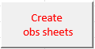
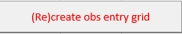
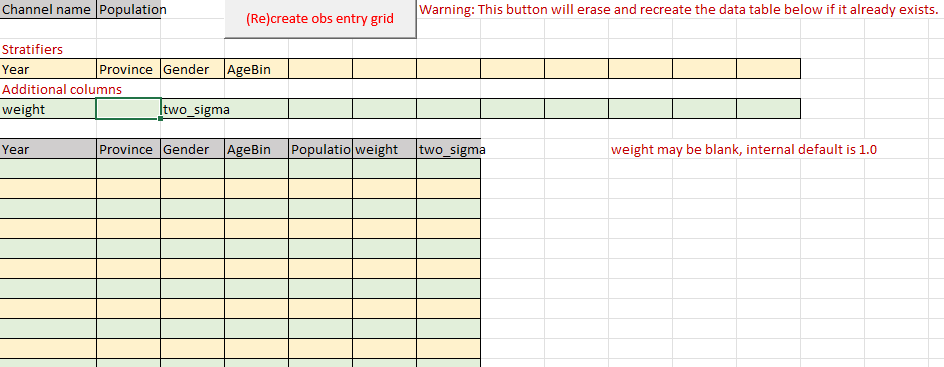

# Ingest Form How-to guides

The [filling an ingest form reference](../reference/filling_an_ingest_form.md) covers the context in which the macros
noted in this how-to are used.  

## How to generate or delete observation data sheets

Adding and removing observational data sheets are both accomplished in an ingest form by use of an Excel macro
on the **Observations metadata** sheet. The macro is executed by clicking this button:

Steps:

1. Add or delete Data Channel entries.
2. Select the corresponding scaling type from the dropdown menus for the modified entries. Scaling means the data 
channel scales with population (for example, a population count) and Non-scaling means it does not (for example, a 
population fraction). A value of **--select--** is blank.
3. Click the above button.

Any observational data sheets that were specified that did previously exist will be created, and any that were removed
(no longer specified) will be deleted. The above button will create and/or remove observational data sheets to ensure
full consistency.

## How to generate or recreate an observation data sheet data entry grid

On the desired observational data sheet:

1. Edit the **Stratifiers** and **Additional columns**
2. Click the following button.

A blank matching data entry grid will be generated. If one already existed, it will be erased and replaced by a blank
table.
 
Example of successful generation:

