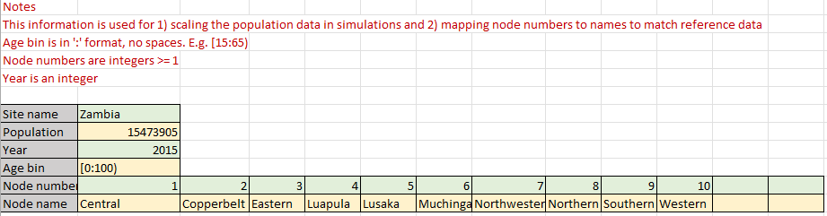
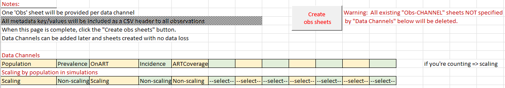
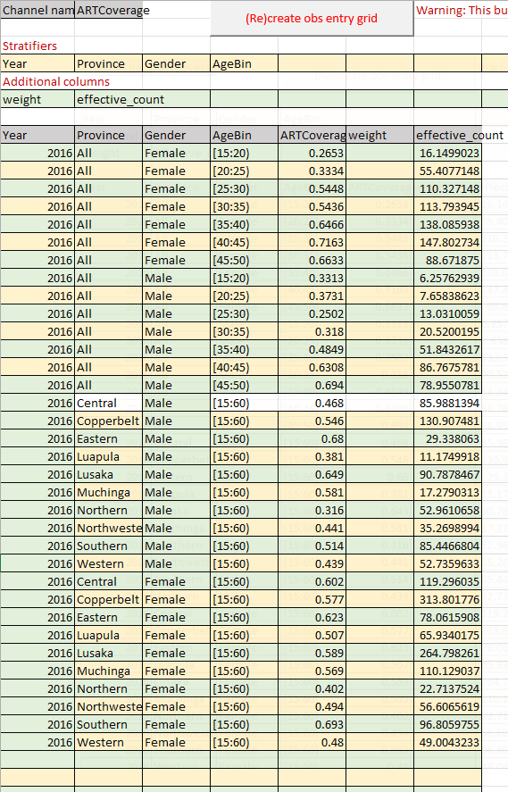
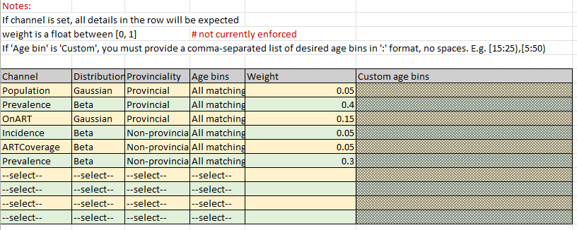
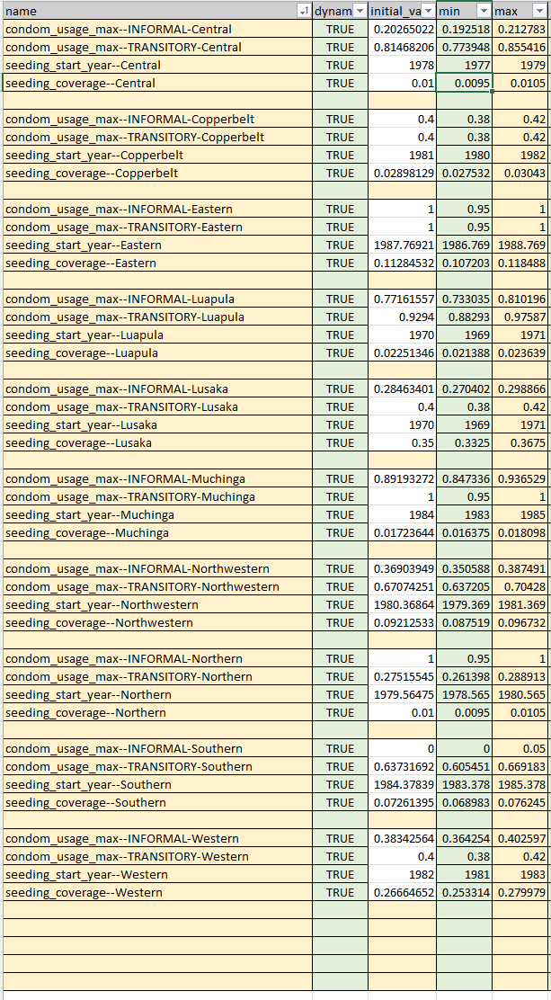

# Filling an Ingest Form

An ingest form is a multi-sheet Excel spreadsheet that organizes reference data and sets analysis controls
for the `calibrate` command. It controls the non-iterative aspects of a calibration process, while the `calibrate`
command arguments control iteration. It is a central component of every emodpy-workflow project.

This tutorial guides the filling of a blank ingest form. One is added to every project created by the `new_project`
command at `calibration/ingest_forms/calibration_ingest_form.xlsm`.

# Ingest Form Sheets

All colored spaces on all sheets are utilized by emodpy-workflow. The colors themselves do not matter, but the default
colored space denotes which sheet cells are interpreted. Any default white space is **not** interpreted and can be used
for anything, for example, calculations, notes, etc.

!!! Important
    Default-colored spaces in an ingest form are interpreted by emodpy-workflow and default white spaces are not.

Excel formulas are not allowed in any interpreted cells, as they cannot be processed by emodpy-workflow. In order to 
use formula-derived values in an interpreted cell, one should perform the calculation in uninterpreted white space and
then copy-paste-by-value into the interpreted cells

!!! Important
    Interpreted cells in an ingest form can only contain values, never formulas.

## Site Sheet

The **Site** sheet contains information that is required for mapping reference obvervational data to the calibration
simulations.

* Site_name: Users can set this to anything

The following values are used for scaling the simulation populations to real-world values in order to make model
results comparable to count-based observations.

* Population: Integer number of people
* Year: The integer year containing this population
* Age bin: The age bin of the population count. See [age bin format](../reference/age_bin_format.md) reference for details.
 
The following values tell EMOD how to map place names used in observations to model nodes.

* Node number: The integer id to use for the simulation nodes, must be at least 1.
* Node name: The name of the node with the corresponding node number.

!!! Important
    The node numbers and names must correspond exactly to the demographics data being used. Please refer to the country
    model demographics code that will be used.

The following example indicates that the ingest form is for a 10-node EMOD Zambia project, utilizing 2015 population
counts of all individuals 0 <= age < 100 for simulation scaling purposes.

## Observations metadata

The **Observations metadata** sheet serves as the beginning of generating the observations sheets. All observational data
channels that will be entered in the ingest form must be entered on this sheet as a "Data Channel". The current accepted
values are:

* Population
* Prevalence
* OnART
* Incidence
* ARTCoverage (or alternately, ARTPrevalence)

For each channel specified, the corresponding scaling-type must be set from the drop-down menus, either 
Scaling or Non-scaling. Scaling means the data channel scales with population (for example, a population count) and
Non-scaling means it does not (for example, a population fraction).

The sheets for recording observational data for use with calibration are generated by an Excel macro using data on
this sheet to help ensure data consistency in the ingest form. The [ingest form how-to](../how_to/how_to_ingest_form.md) 
guide details use of the macro.

## Macro-generated Observation Sheets

1. Define data stratification and uncertainty data channel

    Each **observation** sheet starts blank and requires the user to specify observational data stratifiers and the type of
data uncertainty that will be specified.

    Though the ingest form itself supports any arbitrary stratifier, the emodpy-workflow code that interprets it does not. 
For now, the stratifiers should always be (case-sensitive):

    * Year: the integer year for the data row.
    * Province: The name of the province/node of the data. This must match a node name on the **Site sheet** if data is
node-specific. If the data is simulation-wide (all-node, usually country-wide), enter **All**.
    * Gender: Male, Female, or Both.
    * AgeBin: The age range of the data row in the standard [age bin format](../reference/age_bin_format.md).

    Additional columns starts with three values:

    * weight: Numerical multiplier >= 0.0, blank means 1.0. Alters the importance of the row in calibration scoring.
    * two_sigma: 2 standard errors of count-type data. **Delete** from "Additional columns" if using fractional data
(specified as Scaling).
    * effective_count: Number of independent measurements (people). **Delete** from "Additional columns" if using count
data (specified as Non-scaling).

    !!! Important
        A user must delete either two_sigma or effective_count for the data entry grid to be valid.

2. Generate the data table

    The data table for recording observational data on an observation sheet is generated by an Excel macro to help ensure
data consistency.

    The [ingest form how-to](../how_to/how_to_ingest_form.md) guide details use of the macro.

3. Enter data in the data table

    Any number of rows in the generated data table can be filled and gaps between rows are ok.

    Every element of a used row must be filled, with the exception of weight, which can be left blank (default 1.0).

    The only invalid data entry is a value of zero (count or fraction), as this causes errors in calibration. Simply delete
such rows or cut/paste such rows into uninterpreted sheet space as documentation.

    !!! Important
        Do not add data values of 0. Just omit them or put them elsewhere in the observation sheet.

    All fractional data (for example, Prevalence) must be between 0.0 and 1.0 (not percent).

    !!! Important
        All non-scaling, population fractional data must be entered as a float between 0.0 and 1.0 .

    

## Analyzers Sheet

The **Analyzers** sheet tells the calibration iteration algorithm how to score each calibration simulation. Each row in
the colored/interpreted space represents a component of the score to compute. The column meanings are as follows:

* Channel: The data channel to score. Requires observation data of this channel in the ingest form.
* Distribution: The type of uncertainty distribution for the observational data. Choose **Gaussian** for count-type
observations with a **two_sigma** uncertainty channel and **Beta** for fractional observations with an 
**effective_count** uncertainty channel.
* Provinciality: Whether per-node (**Provincial**) or all-node (**Non-provincial**) data will be scored.
* Age bins: The age bins of data to score. Choose **All matching** for all observation/simulation matching age bins or
**Custom** to define a subset.
* Custom age bins: If using **Custom** age bin scoring, this cell contains a comma-separated list of one or more
age bins in the standard [age bin format](../reference/age_bin_format.md).
* Weight: How heavily to consider the score of each particular analyzer. The weights of all anlayzers will be normalized 
and are multipliers (0.0 to 1.0) on the individual analyzer scores.

!!! Important
    For clarity, it is recommended the weights sum to 1.0 .

The following example defines six differnt analyzers to use in the scoring of each calibration simulation. It mixes 
multiple different channels of data, some counting and some fractional, some per-node and some all-node. Note that
there are **two** Prevalence analyzers, one for per-node and one for all-node data; multiple analyzers per channel is a
supported feature.

!!! Important
    Multiple analyzers per channel using different observational subsets is supported.

## Model Parameters Sheet

The **Model Parameters** sheet tells the calibration iteration algorithm which hyperparameters it can alter during 
calibration to find better model fits to the provided observations. Each row specifies a hyperparameter and its limits:

* name: The hyperparameter name (including its label, if applicable).
* dynamic: Should always be **TRUE**. Only exists for back-compatibility purposes.
* initial_value: The value to use for the hyperparameter at the very beginning of a calibration process. It must be
within the specified min and max values: **min** <= initial_value <= **max**.
* min: The minimum value the calibration algorithm can use. Must be less than **max**.
* max: The maximum value the calibration algorighm can use. Must be greater than **min**.
* map_to: If present, only exists for back-compatibility purposes. Does not need to be filled.

Information about definining and using hyperparameters is covered in the 
[using parameterized calls tutorial](../tutorials/using_parameterized_calls.md).

Finding currently available hyperparameters is detailed in the 
[how to list hyperparameters](../how_to/how_to_list_hyperparameters.md) guide.

The following example specifies 40 different hyperparameters (with their labels) for use with calibration.

# Specifying an ingest form for use in a project

An ingest form is specified for use with calibration via an entry in project-level file `manifest.py`, detailed in the
[project reference](../reference/projects.md).