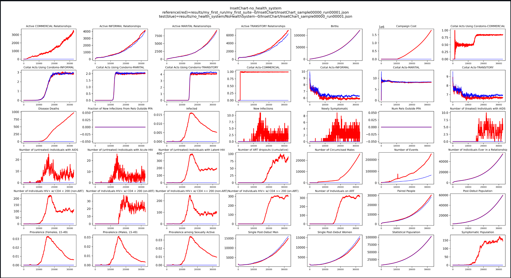

# Modify campaign: Minimal campaign 

## Purpose
This tutorial introduce the campaign basic and Casecade of Care in HIV health system and how to create and run a 
minimal campaign with no interventions, establishing a simulation baseline.

## Campaign basics

The **campaign** is the primary mechanism in EMOD for introducing changes in the simulation over time. It defines when, 
where, and to whom interventions are delivered. Through campaigns, you can simulate programmatic activities such as HIV 
testing, ART initiation, PrEP rollout, and more. Campaigns control behavior through event-based triggers, targeting 
criteria, and time-based schedules.

In Emodpy 2.0, modular building blocks for the campaign module have been introduced, giving users the flexibility to 
mix and match components as needed. Previously, interventions and their distribution mechanisms (event coordinators) 
were tightly coupled. Now, they are separated, making it easier to adjust how interventions are distributed and how 
other campaign logic is configured.

## Cascade of care in the HIV health system

The **cascade of care (CoC)** in `emodpy-hiv` models the journey of individuals through the HIV care continuum, 
including testing, linkage to care, treatment initiation, and retention. The CoC is represented as a series of states 
that individuals can transition through based on interventions and their health status. 
Key states in the CoC include:

- HCT (HIV Counseling and Testing)
- Linkage to ART or PrEP
- ART initiation and retention
- Loss to follow-up and reengagement

These states are configurable and form a modular representation of the HIV health system embedded in the campaign logic.

## Prerequisites
Before starting this tutorial, please complete the following:

- [Create project](./create_project.md) tutorial to create a new project with a baseline frame.
- [Run EMOD](./run_emod.md) tutorial to understand how to run simulations and plot results with baseline frame.

## Minimal campaign tutorial: Removing all campaign features
This tutorial demonstrates how to create a minimal campaign by removing all campaign features. This approach is useful 
for establishing a baseline simulation without any interventions, triggers, or programmatic activities.

### a. Extend frame

To create a frame called `minimal_campaign` extended from the baseline, run the following command in the project 
directory:

```bash
python -m emodpy_workflow.scripts.extend_frame --source baseline --dest minimal_campaign
```

This inherits the `baseline` configuration (similar to Python class inheritance) and allows you to remove or simplify 
the CoC logic in `minimal_campaign`. For this tutorial, we will remove all campaign features.

### b. Modify campaign

In the `frames/minimal_campaign` directory, open `campaign.py`. Remove all campaign elements from the country model by 
updating the `get_campaign_parameterized_calls` function to return an empty list. We comment out the line that calls the
`source_frame.model.campaign_parameterizer` function, which adds all the campaign elements from the country model and 
add simply return an empty list (see line 2 - 5 in the code snippet below).

This ensures no interventions or events are included in the campaign, while still calling the country model's 
`initialize_campaign` function to retain essential setup (such as Base_Year).

```python
def get_campaign_parameterized_calls(campaign: emod_api.campaign) -> List[ParameterizedCall]:
    # parameterized_calls = source_frame.model.campaign_parameterizer(campaign=campaign)
    # Add any additional ParameterizedCalls here
    parameterized_calls = []
    return parameterized_calls
```

### c. Run EMOD

Run the simulation using the following command:

```bash
python -m emodpy_workflow.scripts.run -N MinimalCampaign -f minimal_campaign -o results/minimal_campaign -p ContainerPlatform
```

Please see the [run EMOD](./run_emod.md) tutorial for more details on this command.

### d. Plot InsetChart

After running the simulation, you can examine the results by plotting the **InsetChart** to compare the minimal campaign 
with the baseline.

1. Download the InsetChart to the `results/minimal_campaign` directory:
```bash
python -m emodpy_workflow.scripts.download -d output/InsetChart.json -r results/minimal_campaign/experiment_index.csv -p ContainerPlatform
```

2. Use the plotting tool to compare the output with the baseline:
```bash
python -m emodpy_hiv.plotting.plot_inset_chart results/my_first_run/my_first_suite--0/InsetChart/InsetChart_sample00000_run00001.json -d results/minimal_campaign/MinimalCampaign--0/InsetChart/ -t "InsetChart-minimal_campaign" -o images/minimal_campaign
```
The first argument is the path to the baseline **InsetChart**, and the `-d` argument specifies the directory containing the
minimal campaign **InsetChart** files.

Here is an example of what you might see in the InsetChart comparing baseline and minimal_campaign:

The red line represents the baseline scenario with the full cascade of care, while the blue line represents the minimal
campaign scenario without any interventions. You may observe differences in HIV incidence, prevalence, and other key 
metrics over time.

## Next steps
You have successfully created and run a minimal campaign in EMOD, establishing a baseline simulation without any 
interventions. Please proceed to the next tutorial, [Modify Campaign: Add HIV Vaccine](./modify_campaign_2_add_vaccine.md), 
where you will learn how to add specific interventions to the campaign and observe their effects on the simulation.