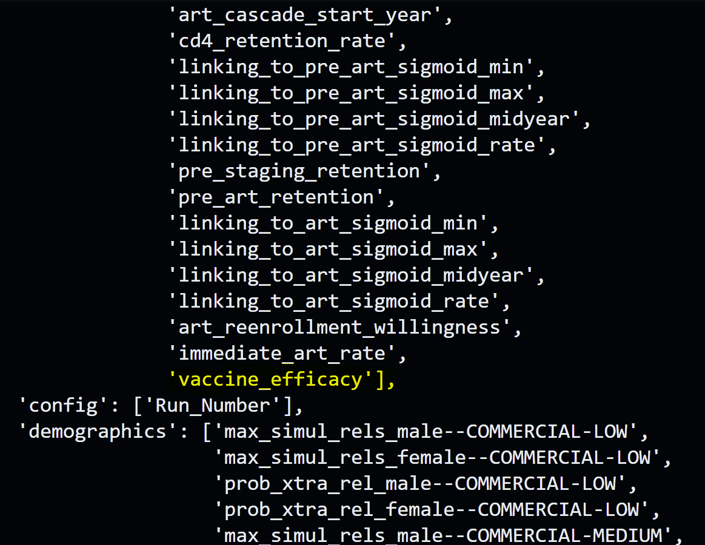
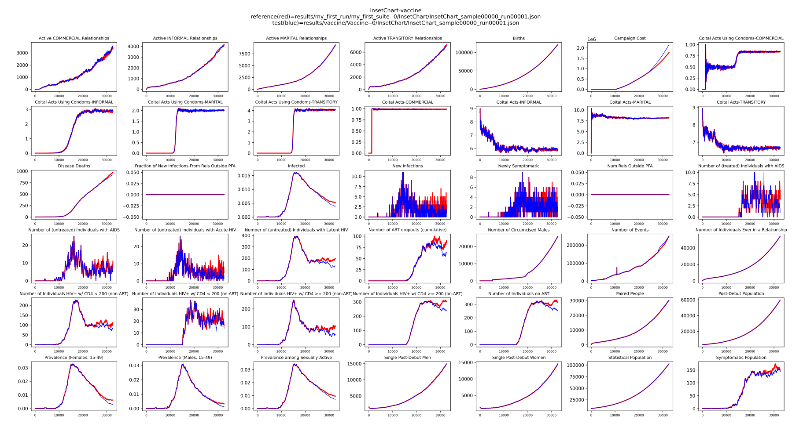

# Modify campaign: Add HIV vaccine


## Prerequisites
Before starting this tutorial, please complete the following:

- [Create project](./create_project.md) tutorial to create a new project with a baseline frame.
- [Run EMOD](./run_emod.md) tutorial to understand how to run simulations and plot results with baseline frame.
- [Modify Campaign: Minimal Campaign](./modify_campaign_1_minimal_campaign.md) to understand the basics of campaign structure, including the cascade of care (CoC).

## Modify the campaign inside a frame directly
You may want to simulate a **change in outcomes** (like introducing a vaccine) without modeling every step in the 
delivery system. The easiest and most direct way to do this is to modify the `campaign.py` inside a frame directly.

Please follow the steps below to add a vaccine to campaign.

### a. Extend frame
Let's extend the baseline frame to create a new frame called `vaccine`:

```bash
python -m emodpy_workflow.scripts.extend_frame --source baseline --dest vaccine
```

### b. Add HIV vaccine directly

Modify `campaign.py` under `my_project/frames/vaccine` folder to include a function that 
adds a vaccine intervention. This tutorial adds:

- Add a ControlledVaccine with a constant WaningConfig.
- Set initial efficacy = 1.0 as default.
- Distribute the vaccine when the person sexually debuts - on the `STIDebut` event.
- Start listening and distributing the vaccine on January 1st, 2026.
- Make initial efficacy a hyperparameter of the method.

Here is an example of how to implement this: (add the following import lines and function to `campaign.py`)

```python linenums="1"
from emodpy_hiv.campaign.individual_intervention import ControlledVaccine
from emodpy_hiv.campaign.distributor import add_intervention_triggered
from emodpy_hiv.campaign.waning_config import Constant


def add_hiv_vaccine(campaign, vaccine_efficacy=1.0):
    vaccine = ControlledVaccine(
        campaign=campaign,
        waning_config=Constant(constant_effect=vaccine_efficacy)
    )
    add_intervention_triggered(
        campaign=campaign,
        intervention_list=[vaccine],
        triggers_list=["STIDebut"],
        start_year=2026
    )
    return campaign
```

In the same `campaign.py` file, update the `get_campaign_parameterized_calls` function by adding a call to 
`add_hiv_vaccine` (see line 4 in the code snippet below). Insert the new `ParameterizedCall` after the existing 
calls (see line 5). This makes `vaccine_efficacy` a hyperparameter that can be modified when running the simulation:

```python linenums="1"
def get_campaign_parameterized_calls(campaign):
    parameterized_calls = source_frame.model.campaign_parameterizer(campaign=campaign)
    # Add any additional ParameterizedCalls here
    pc = ParameterizedCall(func=add_hiv_vaccine, hyperparameters={'vaccine_efficacy': None})
    parameterized_calls.append(pc)
    return parameterized_calls
```

### c. Check hyperparameter
You can check that the `vaccine_efficacy` is now an available hyperparameter in campaign.py by running:

```bash
python -m emodpy_workflow.scripts.available_parameters -F vaccine
``` 

You should see `vaccine_efficacy` listed under Campaign parameters.



### d. Run EMOD
Now you can run EMOD with the new vaccine frame:

```bash
python -m emodpy_workflow.scripts.run -N Vaccine -f vaccine -o results/vaccine -p ContainerPlatform
```

Please see the [run EMOD](./run_emod.md) tutorial for more details on this command.

### e. Plot InsetChart

After running the simulation, you can examine the results by plotting the **InsetChart** to compare the vaccine frame with 
the baseline.

1. Download the **InsetChart** to the `results/vaccine` directory:
```bash
python -m emodpy_workflow.scripts.download -d output/InsetChart.json -r results/vaccine/experiment_index.csv -p ContainerPlatform
```

2. Plot **InsetChart** and compare with baseline:
```bash
python -m emodpy_hiv.plotting.plot_inset_chart results/my_first_run/my_first_suite--0/InsetChart/InsetChart_sample00000_run00001.json -d results/vaccine/Vaccine--0/InsetChart -t "InsetChart-vaccine" -o images/vaccine
```

After plotting, you should see prevalence drops but costs go up after year 2026 when the 
vaccine is introduced. The red line is the baseline and the blue line is the vaccine frame.

Visualize results:


### f. Plot ReportHIVByAgeAndGender
You can plot **ReportHIVByAgeAndGender** so you can look at infection count across age groups.

1.  Download the **ReportHIVByAgeAndGender** to the `results/vaccine` directory:
```bash
python -m emodpy_workflow.scripts.download -d output/ReportHIVByAgeAndGender.csv -r results/vaccine/experiment_index.csv -p ContainerPlatform
```

2. Visualize infection counts across age groups:
```bash
python -m emodpy_hiv.plotting.plot_hiv_by_age_and_gender results/vaccine/Vaccine--0/ReportHIVByAgeAndGender/ -p prevalence -a -m -o images/vaccine
```

Here is an example of what you might see in the **ReportHIVByAgeAndGender** for vaccine frame:


## Next steps
You have successfully added an HIV vaccine to the campaign inside a frame directly. You can further explore the 
following options:
- Experiment with different vaccine efficacies by modifying the `vaccine_efficacy` hyperparameter when running the 
simulation. Please see the [Sweep Parameter](./sweep_parameter.md) tutorial for more details.
- Learn how to update the campaign by modifying the CountryModel in the [Modify Campaign: Modify Country Model](./modify_campaign_3_modify_country_model.md) tutorial.