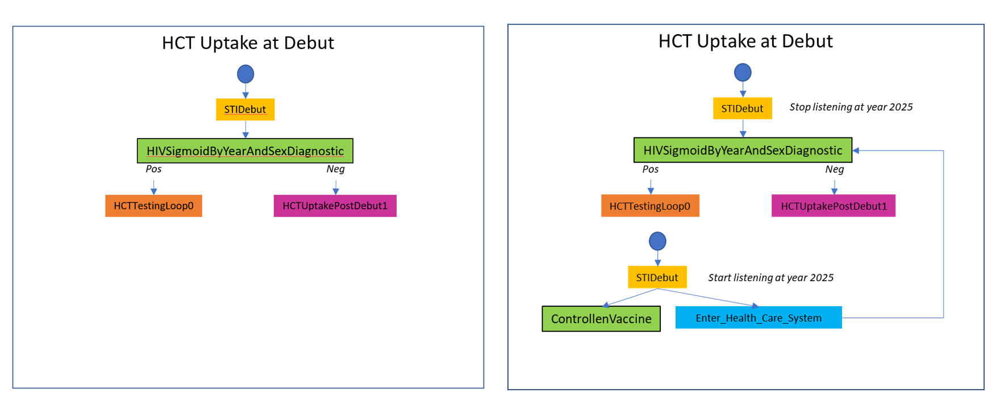
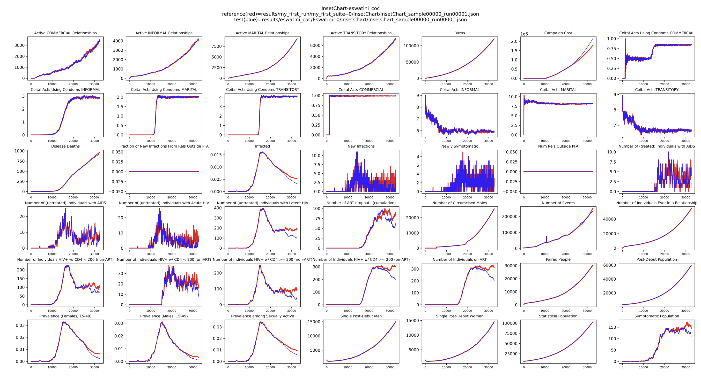
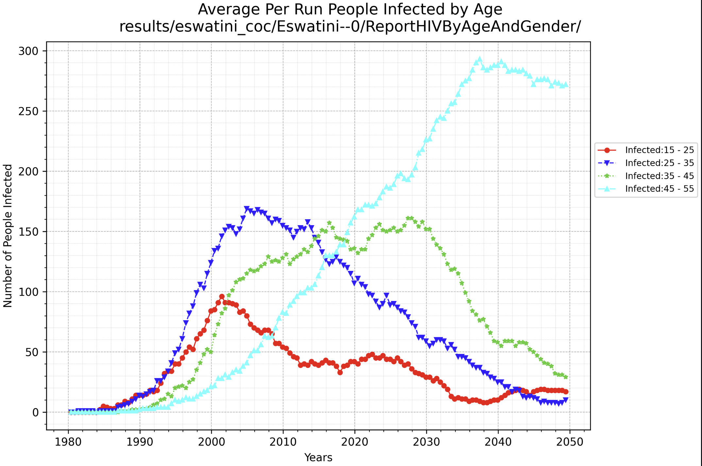

# Modify campaign: Modify country model

## Country model basics

A **country model** in `emodpy-hiv` encapsulates campaign logic specific to a setting (like `Zambia` and `ZambiaForTraining`).
Subclassing allows you to override methods like `add_state_HCTUptakeAtDebut()` to customize intervention logic.

You can find country models in the `emodpy_hiv/country` directory. Each country model is a subclass of the base 
`Country` class and implements methods to define the cascade of care and other interventions. You can create a new 
country model by subclassing an existing one and overriding specific methods to change behavior. This allows you to 
tailor the campaign logic to different settings or scenarios, which has more control than editing the campaign.py 
inside the frame. Moreover, country models are inherently more shareable and reusable between researchers as they can 
be added to `emodpy-hiv` for future projects.

In this tutorial, we will create a new country model for `ZambiaWithLongLastingPrep` by subclassing the 
`ZambiaForTraining` country model and modifying the `add_state_HCTUptakeAtDebut()` method to distribute a long-lasting 
form of PrEP at sexual debut.

## Prerequisites
Before starting this tutorial, please complete the following:

- [Create project](./create_project.md) tutorial to create a new project with a baseline frame.
- [Run EMOD](./run_emod.md) tutorial to understand how to run simulations and plot results with baseline frame.
- [Modify Campaign: Minimal Campaign](./modify_campaign_1_minimal_campaign.md) to understand the basics of campaign 
structure, including the cascade of care (CoC).
- [Modify Campaign: Add HIV Vaccine](./modify_campaign_2_add_vaccine.md) to understand how to add interventions 
directly to a campaign.

## Modify the campaign by changing the country model

### a. Create new frame

Make a new frame with `ZambiaWithLongLastingPrep` country model by running the following command in the project directory:

```bash
python -m emodpy_workflow.scripts.new_frame --country ZambiaWithLongLastingPrep --dest ZambiaWithLongLastingPrep_coc
```

!!! Important
    Since `ZambiaWithLongLastingPrep` is a country model that doesn't exist yet, the `emodpy_workflow` does not know where 
    to find it. You will get a warning saying that this country model cannot be found. This warning can be ignored for 
    now, as you will creating it in the next section.

### b. Create ZambiaWithLongLastingPrep country model

In the ZambiaWithLongLastingPrep_coc directory, create a new country model called `ZambiaWithLongLastingPrep` by 
subclassing the `ZambiaForTraining` Country Model and override `add_state_HCTUptakeAtDebut()` method to distribute a 
long-lasting form of PrEP at sexual debut, followed by a decision point for HIV testing uptake. The long-lasting PrEP is
distributed starting in 2025, and the HIV testing uptake decision point is triggered by a new event, 
**Enter_Health_Care_System**, which is broadcast when individuals receive the long-lasting PrEP. The HIV testing uptake
decision point stops listening for the **STIDebut** event after 35 years (i.e., after 2025).

Here are the detailed steps:

1. Create a new Python file named `zambia_withlong_lasting_prep.py` in the `frames/ZambiaWithLongLastingPrep_coc` directory:

    Add the following import statements at the top of the file:
```python
import emod_api
from emodpy_hiv.campaign.distributor import add_intervention_triggered
from emodpy_hiv.campaign.individual_intervention import (
  HIVSigmoidByYearAndSexDiagnostic,
  ControlledVaccine,
  BroadcastEvent,
  Sigmoid
)
from emodpy_hiv.campaign.common import CommonInterventionParameters, PropertyRestrictions
import emodpy_hiv.campaign.cascade_of_care as coc
from emodpy_hiv.countries import ZambiaForTraining 
from emodpy_hiv.campaign.waning_config import Constant
```

2. Define the `ZambiaWithLongLastingPrep` class that subclasses `ZambiaForTraining`:
```python
class ZambiaWithLongLastingPrep(ZambiaForTraining):
  country_name = "ZambiaWithLongLastingPrep"
```
The next few steps override the `add_state_HCTUptakeAtDebut()` method to implement the new logic.

3. Copy the `add_state_HCTUptakeAtDebut()` Function:

    Copy this function from the Country class and cascade_of_care.py to your new `ZambiaWithLongLastingPrep` class. Please see 
[Modify Campaign: Minimal Campaign](./modify_campaign_1_minimal_campaign.md) Cascade of Care section for more details 
on this function.
```Python
@classmethod
def add_state_HCTUptakeAtDebut(
  cls,
  campaign: emod_api.campaign,
  start_year: float,
  node_ids: list[int] = None
):
  disqualifying_properties = [
      coc.CascadeState.LOST_FOREVER,
      coc.CascadeState.ON_ART,
      coc.CascadeState.LINKING_TO_ART,
      coc.CascadeState.ON_PRE_ART,
      coc.CascadeState.LINKING_TO_PRE_ART,
      coc.CascadeState.ART_STAGING
  ]
  initial_trigger = coc.CustomEvent.STI_DEBUT
  hct_upate_at_debut_pv = coc.CascadeState.HCT_UPTAKE_AT_DEBUT

  # set up health care testing uptake at sexual debut by time
  female_multiplier = 1.0
  uptake_choice = HIVSigmoidByYearAndSexDiagnostic(
      campaign,
      year_sigmoid=Sigmoid(min=-0.005, max=0.05, mid=2005, rate=1),
      positive_diagnosis_event=coc.HCT_TESTING_LOOP_TRIGGER,
      negative_diagnosis_event=coc.HCT_UPTAKE_POST_DEBUT_TRIGGER_1,
      female_multiplier=female_multiplier,
      common_intervention_parameters=CommonInterventionParameters(
          disqualifying_properties=disqualifying_properties,
          new_property_value=hct_upate_at_debut_pv
      )
  )
  add_intervention_triggered(
      campaign,
      intervention_list=[uptake_choice],
      triggers_list=[initial_trigger],
      start_year=start_year,
      property_restrictions=PropertyRestrictions(
          individual_property_restrictions=[['Accessibility:Yes']]
      ),
      node_ids=node_ids,
      event_name='HCTUptakeAtDebut: state 0 (decision, sigmoid by year and sex)'
  )
  return (
      coc.HCT_TESTING_LOOP_TRIGGER,  # return the trigger for the HCTTestingLoop state
      coc.HCT_UPTAKE_POST_DEBUT_TRIGGER_1
  )
```

4. Modify Event Listening Duration:
    
    Adjust the copied function so that it behaves like the baseline, but stops after 35 years or by 2025 (i.e., stop 
listening for the **STIDebut** event after that time). In order to do this, set the duration parameter in the 
`add_intervention_triggered()` function to 365 * 35 days (35 years) when distributing the `uptake_choice` intervention.
    You can modify line 32  - 42 in the copied function to include a `duration` parameter and set it to 35 years:
```python
# stop listing for STIDebut after 35 years.
duration = 365 * 35
add_intervention_triggered(
      campaign,
      intervention_list=[uptake_choice],
      triggers_list=[initial_trigger],
      start_year=start_year,
      property_restrictions=PropertyRestrictions(
          individual_property_restrictions=[['Accessibility:Yes']]
      ),
      node_ids=node_ids,
      event_name='HCTUptakeAtDebut: state 0 (decision, sigmoid by year and sex)',
      duration=duration
  )
```

5. Insert Long-Lasting PrEP Distribution:

    Before the normal decision point (the sigmoid choice), begin listening for the **STIDebut** event, distribute a very long-lasting form of 
PrEP(ControlledVaccine), and broadcast a new event, **Enter_Health_Care_System**, starting in the year 2025.
```python
# insert a long-lasting ControlledVaccine
laprep_start_year = start_year + duration / 365
vaccine = ControlledVaccine(
   campaign,
   waning_config=Constant(0.99),
   common_intervention_parameters=CommonInterventionParameters(
       disqualifying_properties=disqualifying_properties,
       new_property_value=hct_upate_at_debut_pv
   )
)
broadcast_event = BroadcastEvent(
   campaign=campaign,
   broadcast_event="Enter_Health_Care_System",
   common_intervention_parameters=CommonInterventionParameters(
       disqualifying_properties=disqualifying_properties,
       new_property_value=hct_upate_at_debut_pv
   )
)
add_intervention_triggered(
   campaign=campaign,
   intervention_list=[vaccine, broadcast_event],
   triggers_list=[initial_trigger],
   start_year=laprep_start_year,
   property_restrictions=PropertyRestrictions(
       individual_property_restrictions=[['Accessibility:Yes']]
   ),
   node_ids=node_ids,
   event_name='HCTUptakeAtDebut: LA-PrEP on STI Debut'
)
```

6. Update Uptake Choice Based on New Event:

    Modify the distribution of the uptake_choice intervention so it depends on the new **Enter_Health_Care_System** 
event starting in year 2025.
```python
# distribute the SigmoidByYearAndSexDiagnostic intervention by Enter_Health_Care_System event
add_intervention_triggered(
   campaign,
   intervention_list=[uptake_choice],
   triggers_list=["Enter_Health_Care_System"],
   start_year=laprep_start_year,
   property_restrictions=PropertyRestrictions(
       individual_property_restrictions=[['Accessibility:Yes']]
   ),
   node_ids=node_ids,
   event_name='HCTUptakeAtDebut: state 0 triggered by Enter_Health_Care_System after 2025'
)
```

On the left side is the original function from `ZambiaForTraining`, and on the right is the modified function for `ZambiaWithLongLastingPrep`.

**Comparison of HCT Uptake at Debut function:**

| ZambiaForTraining (original) | ZambiaWithLongLastingPrep (modified) |
|-----------------------------|---------------------|
| See comparison below        | See comparison below|



!!! Important
    In this tutorial, the `ZambiaForTraining` class serves as the base for `ZambiaWithLongLastingPrep`. 
    `ZambiaForTraining` is similar to the `Zambia` country model but utilizes a smaller population to accelerate 
    simulation time.

    You may select any country model class to use as a base class in your projects.

Here is a complete example of the `zambia_withlong_lasting_prep.py` file with line numbers for easier reference:

```python linenums="1"
import emod_api
from emodpy_hiv.campaign.distributor import add_intervention_triggered
from emodpy_hiv.campaign.individual_intervention import (
    HIVSigmoidByYearAndSexDiagnostic,
    ControlledVaccine,
    BroadcastEvent,
    Sigmoid
)
from emodpy_hiv.campaign.common import CommonInterventionParameters, PropertyRestrictions
import emodpy_hiv.campaign.cascade_of_care as coc
from emodpy_hiv.countries import ZambiaForTraining 
from emodpy_hiv.campaign.waning_config import Constant


class ZambiaWithLongLastingPrep(ZambiaForTraining):
    country_name = "ZambiaWithLongLastingPrep"

    @classmethod
    def add_state_HCTUptakeAtDebut(
        cls,
        campaign: emod_api.campaign,
        start_year: float,
        node_ids: list[int] = None
    ):
        disqualifying_properties = [
            coc.CascadeState.LOST_FOREVER,
            coc.CascadeState.ON_ART,
            coc.CascadeState.LINKING_TO_ART,
            coc.CascadeState.ON_PRE_ART,
            coc.CascadeState.LINKING_TO_PRE_ART,
            coc.CascadeState.ART_STAGING
        ]
        initial_trigger = coc.CustomEvent.STI_DEBUT
        hct_upate_at_debut_pv = coc.CascadeState.HCT_UPTAKE_AT_DEBUT

        # set up health care testing uptake at sexual debut by time
        # stop listing for STIDebut after 35 years.
        female_multiplier = 1.0
        duration = 365 * 35
        uptake_choice = HIVSigmoidByYearAndSexDiagnostic(
            campaign,
            year_sigmoid=Sigmoid(min=-0.005, max=0.05, mid=2005, rate=1),
            positive_diagnosis_event=coc.HCT_TESTING_LOOP_TRIGGER,
            negative_diagnosis_event=coc.HCT_UPTAKE_POST_DEBUT_TRIGGER_1,
            female_multiplier=female_multiplier,
            common_intervention_parameters=CommonInterventionParameters(
                disqualifying_properties=disqualifying_properties,
                new_property_value=hct_upate_at_debut_pv
            )
        )
        add_intervention_triggered(
            campaign,
            intervention_list=[uptake_choice],
            triggers_list=[initial_trigger],
            start_year=start_year,
            property_restrictions=PropertyRestrictions(
                individual_property_restrictions=[['Accessibility:Yes']]
            ),
            node_ids=node_ids,
            event_name='HCTUptakeAtDebut: state 0 (decision, sigmoid by year and sex)',
            duration=duration
        )

        # insert a long-lasting ControlledVaccine
        laprep_start_year = start_year + duration / 365
        vaccine = ControlledVaccine(
            campaign,
            waning_config=Constant(0.99),
            common_intervention_parameters=CommonInterventionParameters(
                disqualifying_properties=disqualifying_properties,
                new_property_value=hct_upate_at_debut_pv
            )
        )
        broadcast_event = BroadcastEvent(
            campaign=campaign,
            broadcast_event="Enter_Health_Care_System",
            common_intervention_parameters=CommonInterventionParameters(
                disqualifying_properties=disqualifying_properties,
                new_property_value=hct_upate_at_debut_pv
            )
        )
        add_intervention_triggered(
            campaign=campaign,
            intervention_list=[vaccine, broadcast_event],
            triggers_list=[initial_trigger],
            start_year=laprep_start_year,
            property_restrictions=PropertyRestrictions(
                individual_property_restrictions=[['Accessibility:Yes']]
            ),
            node_ids=node_ids,
            event_name='HCTUptakeAtDebut: LA-PrEP on STI Debut'
        )
        # distribute the SigmoidByYearAndSexDiagnostic intervention by Enter_Health_Care_System event
        add_intervention_triggered(
            campaign,
            intervention_list=[uptake_choice],
            triggers_list=["Enter_Health_Care_System"],
            start_year=laprep_start_year,
            property_restrictions=PropertyRestrictions(
                individual_property_restrictions=[['Accessibility:Yes']]
            ),
            node_ids=node_ids,
            event_name='HCTUptakeAtDebut: state 0 triggered by Enter_Health_Care_System after 2025'
        )
        return (
            coc.HCT_TESTING_LOOP_TRIGGER,  # return the trigger for the HCTTestingLoop state
            coc.HCT_UPTAKE_POST_DEBUT_TRIGGER_1
        )
```

### c. Update frame to use new country model
Now the `ZambiaWithLongLastingPrep` country model has been created, it is not yet recognized by `emodpy-workflow` or 
`emodpy-hiv`. To use this new country model in the `ZambiaWithLongLastingPrep_coc` frame, you need to update the frame 
to reference it. For simplicity in this tutorial, move the file to the frame directory and import it directly in `campaign.py`.

!!! Important
    Ideally, if you want to make the new country model reusable, you can put it in the `emodpy_hiv/country` directory and 
    import it in `campaign.py`. Please see [step g](#g-optional-public-zambiawithlonglastingprep-country-model) for more 
    details. For the current step in this tutorial, we will keep it simple and just move the file to the frame directory.

Modify the import statement in `campaign.py`, `config.py`, and `demographics.py` to import the `ZambiaWithLongLastingPrep` country 
model:

In each file, comment out the current country model import line(line 1) and replace it with an import for 
`ZambiaWithLongLastingPrep` (line 2 - 4).

```python linenums="1"
# from emodpy_hiv.countries import ZambiaWithLongLastingPrep as country_model
import sys, os
sys.path.insert(0, os.path.dirname(os.path.abspath(__file__)))
from zambia_withlong_lasting_prep import ZambiaWithLongLastingPrep as country_model
```

### d. Run EMOD
Now you can run EMOD with the new `ZambiaWithLongLastingPrep_coc` frame:
```bash
python -m emodpy_workflow.scripts.run -N ZambiaWithLongLastingPrep -f ZambiaWithLongLastingPrep_coc -o results/ZambiaWithLongLastingPrep_coc -p ContainerPlatform
```
Please see the [run EMOD](./run_emod.md) tutorial for more details on this command.

### e. Plot InsetChart

After running the simulation, you can examine the results by plotting the **InsetChart** to compare the `ZambiaWithLongLastingPrep_coc` frame 
with the baseline.

1. Download the **InsetChart** to the `results/ZambiaWithLongLastingPrep_coc` directory:
```bash
python -m emodpy_workflow.scripts.download -d output/InsetChart.json -r results/ZambiaWithLongLastingPrep_coc/experiment_index.csv -p ContainerPlatform
```

2. Use the plotting tool to compare the output with the baseline:

```bash
python -m emodpy_hiv.plotting.plot_inset_chart results/my_first_run/my_first_suite--0/InsetChart/InsetChart_sample00000_run00001.json -d results/ZambiaWithLongLastingPrep_coc/ZambiaWithLongLastingPrep--0/InsetChart/ -t "InsetChart-ZambiaWithLongLastingPrep_coc" -o images/ZambiaWithLongLastingPrep_coc
```
Here is an example of what you might see in the **InsetChart** comparing baseline and `ZambiaWithLongLastingPrep_coc`:


You should see prevalence drops but costs go up after year 2025 when the long-lasting PrEP is introduced. The red line 
is the baseline and the blue line is the `ZambiaWithLongLastingPrep_coc` frame.

### f. Plot ReportHIVByAgeAndGender

Next, we plot the number of infected people from **ReportHIVByAgeAndGender** across ages to highlight that it takes decades
for older age group infection counts to stabilize in response to the ZambiaWithLongLastingPrep campaign.

1. Download the **ReportHIVByAgeAndGender** to the `results/ZambiaWithLongLastingPrep_coc` directory:
```bash
python -m emodpy_workflow.scripts.download -d output/ReportHIVByAgeAndGender.csv -r results/ZambiaWithLongLastingPrep_coc/experiment_index.csv -p ContainerPlatform
```

2. Visualize infection counts across age groups:

```bash
python -m emodpy_hiv.plotting.plot_hiv_by_age_and_gender results/ZambiaWithLongLastingPrep_coc/ZambiaWithLongLastingPrep--0/ReportHIVByAgeAndGender/ -p prevalence -a -m -o images/ZambiaWithLongLastingPrep_coc
```
Here is an example of what you might see in the **ReportHIVByAgeAndGender** for ZambiaWithLongLastingPrep_coc frame:


### g. Optional: Public ZambiaWithLongLastingPrep country model
If you want to make the `ZambiaWithLongLastingPrep` country model reusable, you can put it in `emodpy-hiv` and use it in `emodpy-workflow`.
Please refer to [How to publish a new country model](../how_to/how_to_publish_new_country_model.md) for more details.

## Conclusion

The 3 campaign tutorials demonstrated how to modify campaign logic in **EMOD** simulations using `emodpy_workflow`, including 
creating minimal campaigns, adding interventions directly, and customizing country models for advanced scenarios. By 
mastering these techniques, you can tailor simulations to specific research questions and programmatic needs.

For further customization, refer to the following tutorials:

- [Modify Config](./modify_configuration.md): Adjust simulation parameters and settings.
- [Modify Demographics](./modify_demographics.md): Change population structure and attributes.
- [Modify Reports](./modify_reports.md): Customize output reports and data collection.

Combining these approaches enables comprehensive control over your **EMOD** workflows and simulation outcomes.