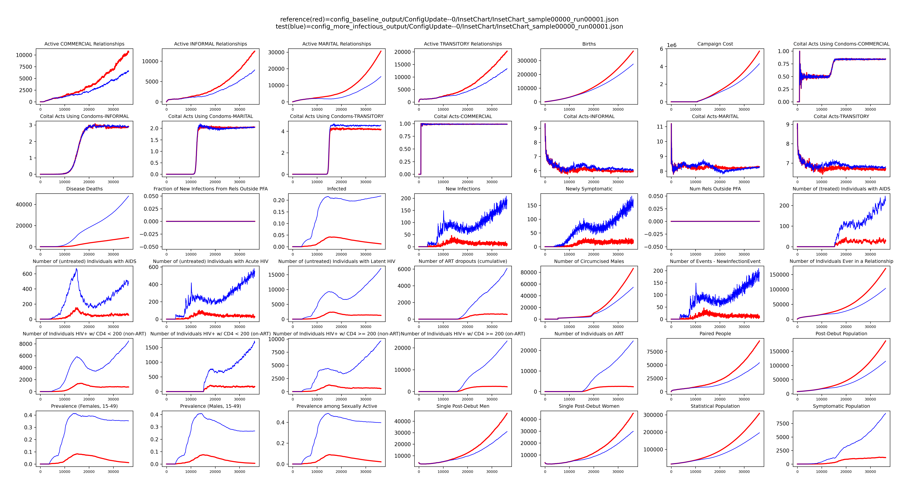

# Modify configuration parameters

Configuration parameters are simulation-wide parameters that affect how EMOD runs at a fundamental level. These include
parameters related, but not limited to:

* Model duration, timestep length, and simulation start time
* How a disease progresses and transmits
* Whether agents can be born, age, and/or die

# Overview

Configuration parameters are assigned values in functions `initialize_config` and `get_config_parameterized_calls` in a
frame, however, it is common practice to set default/initial values in the country model versions of these methods.

# Example

In this example, we update the value of configuration parameter named **Base_Infectivity**, which alters how infectious
a disease is at a fundamental level (before any other modifiers apply).

## Prerequisites

This tutorial requires you to have done the following:

- [Setup and installed emodpy-workflow](setup.md)
- [Created a project and a frame](create_project.md)
- [Learned how to run EMOD](run_emod.md)

## Extend the baseline frame for alteration

```bash 
python -m emodpy_workflow.scripts.extend_frame --source baseline --dest more_infectious
```

## Edit the frame config.py

Here we edit the `initialize_config` function, opting to not make a hyperparameter for setting `Base_Infectivity` for
simplicity. An alternative example that makes a hyperparameter is located at 
[how to use elements in a frame](../how_to/how_to_use_elements_in_frame.md).

Edit file `frames/more_infectious/config.py` to have 10 times greater infectivity. It should contain the following:

```python  
from typing import List

from emod_api.schema_to_class import ReadOnlyDict
from emodpy_hiv.parameterized_call import ParameterizedCall
from emodpy_hiv.reporters.reporters import Reporters

from .. import baseline as source_frame


def initialize_config(manifest):
    config = source_frame.model.config_initializer(manifest=manifest)
    config.parameters.x_Base_Population = config.parameters.x_Base_Population
    config.parameters.Base_Infectivity = config.parameters.Base_Infectivity * 10  # Increasing infectivity here.
    return config


def get_config_parameterized_calls(config: ReadOnlyDict) -> List[ParameterizedCall]:
    parameterized_calls = source_frame.model.config_parameterizer(config=config)
    return parameterized_calls


def build_reports(reporters: Reporters):
    reporters = source_frame.model.build_reports(reporters)
    return reporters
```

## Run EMOD

We will run the **baseline** frame and **more_infectious** frames:

```bash
python -m emodpy_workflow.scripts.run -f baseline -N ConfigUpdate -o config_baseline_output -p ContainerPlatform -d output/InsetChart.json
```

```bash
python -m emodpy_workflow.scripts.run -f more_infectious -N ConfigUpdate -o config_more_infectious_output -p ContainerPlatform -d output/InsetChart.json
```


## Compare InsetChart.json

Run:

```bash
python -m emodpy_hiv.plotting.plot_inset_chart config_baseline_output/ConfigUpdate--0/InsetChart/InsetChart_sample00000_run00001.json config_more_infectious_output/ConfigUpdate--0/InsetChart/InsetChart_sample00000_run00001.json
```

Blue below represents the **more_infectious** frame and red represents the frame **baseline**. As can be seen, highly
infectious HIV results in higher infection rates and mortality.


