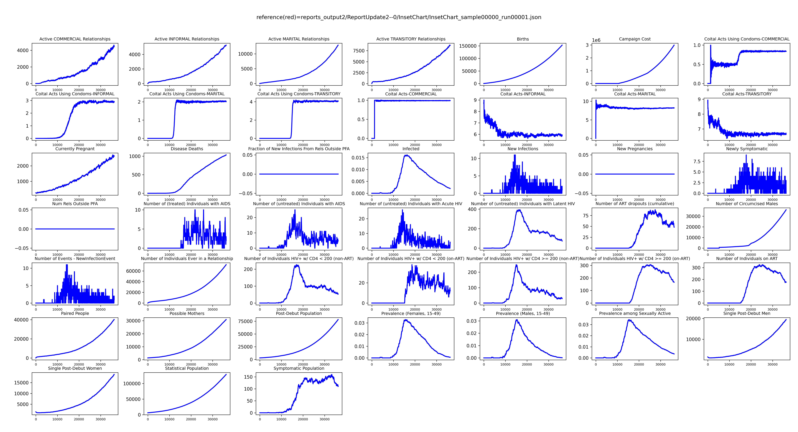

# Modify reports

Reports are output (files) generated by EMOD. There are multiple built-in EMOD reports that are configured by Python 
code as well as the ability to create custom reports for a project.

# Overview

Reports are specified as Python code in a country model or a frame that builds from one. Reports that are frequently
used and/or infrequently modified for a given country model are often located in it. Project-specific reports or
custom configurations of common reports are typically located in the ``config.py`` file in a frame.

!!! Important
    The more data items and/or stratification levels a report is configured to capture the larger the files generated. 
    Keep reporting configurations as minimal as useful for a project to avoid massive files that are difficult to 
    process.

# Prerequisites

This tutorial requires you to have done the following:

- [Setup and installed emodpy-workflow](setup.md)
- [Created a project and a frame](create_project.md)
- [Learned how to run EMOD](run_emod.md)

# Modify an existing report configuration

Here we demonstrate overriding the existing configuration of a report in a project frame that utilizes the 
ZambiaForTraining country model.

The ZambiaForTraining country model class exists in: ``emodpy_hiv/countries/zambia.py``. The following snippet from the 
ZambiaForTraining country model (it inherits from class Zambia above it) indicates its default specification of the 
**InsetChart** report:

```python  linenums="1"
@classmethod
def build_reports(cls, reporters: Reporters) -> Reporters:
    reporters = super().build_reports(reporters=reporters)

    # ...

    reporters.add(InsetChart(reporters_object=reporters,
                             has_ip=None,  # default
                             has_interventions=None,      # default
                             include_pregnancies=False,   # default
                             include_coital_acts=True,    # default
                             event_channels_list=["NewInfectionEvent"]))

    # ...
```

If we wish to override this behavior in a project frame **without modifying the country model** we will need to override
it in our frame. Reports are specified as part of the EMOD config file, so we edit the frame file:``config.py``. This 
file typically contains (at minimum) the following function definition ready for us to use:

```python linenums="1"
def build_reports(reporters: Reporters):
    reporters = country_model.build_reports(reporters)
    return reporters
```

!!! Important
    Each report can only have at most ONE configuration. Duplicative configurations will generate an error.

First, remove the existing report that you do not want. Then we add a new definition of the report to replace it. For
example, if you want to add information about pregnancies and potential mothers in the model, copy/paste the 
**InsetChart** definition from the ZambiaForTraining country model (again, it inherits this from class Zambia, above it)
and modify the appropriate parameter (**include_pregnancies=True**) (labeled below with **NEW CODE**):

```python linenums="1"
def build_reports(reporters: Reporters):
    from emodpy_hiv.reporters.reporters import InsetChart

    reporters = country_model.build_reports(reporters)

    # Remove default built-in InsetChart configuration
    reporters.config_reporters = [reporter for reporter in reporters.config_reporters
                                  if not isinstance(reporter, InsetChart)]

    # Add new InsetChart configuration that records pregnancy information
    reporters.add(InsetChart(reporters_object=reporters,
                             has_ip=None,  # default
                             has_interventions=None,  # default
                             # NEW CODE
                             include_pregnancies=True,  # NOT the default
                             include_coital_acts=True,  # default
                             event_channels_list=["NewInfectionEvent"]))

    return reporters
```

Future executions of EMOD using this frame will now generate an ``InsetChart.json`` output file containing pregnancy
related data.

## Run EMOD

```bash
python -m emodpy_workflow.scripts.run -f baseline -N ReportUpdate1 -o reports_output1 -p ContainerPlatform -d output/InsetChart.json
```

## Plot InsetChart.json

```bash
python -m emodpy_hiv.plotting.plot_inset_chart reports_output1/ReportUpdate1--0/InsetChart/InsetChart_sample00000_run00001.json
```

Example result with pregnancy related information:




# Adding a new report configuration

Suppose we now want to add a project-specific report (**ReportRelationshipEnd**) that is not already included in the 
ZambiaForTraining country model or our frame ``config.py``. We will need to add the report in the **build_reports** 
function in our frame. Building on the prior example, we edit the frame ``config`.py`` like so (labeled below with 
**NEW CODE**):

```python linenums="1"
def build_reports(reporters: Reporters):
    # NEW CODE: Added import of ReportRelationshipEnd
    from emodpy_hiv.reporters.reporters import InsetChart, ReportRelationshipEnd

    reporters = country_model.build_reports(reporters)

    # Remove default built-in InsetChart configuration
    reporters.config_reporters = [reporter for reporter in reporters.config_reporters
                                  if not isinstance(reporter, InsetChart)]

    # Add new InsetChart configuration that records pregnancy information
    reporters.add(InsetChart(reporters_object=reporters,
                             has_ip=None,  # default
                             has_interventions=None,  # default
                             include_pregnancies=True,  # NOT the default
                             include_coital_acts=True,  # default
                             event_channels_list=["NewInfectionEvent"]))

    # NEW CODE
    # Add ReportRelationshipEnd report
    reporters.add(ReportRelationshipEnd(reporters_object=reporters))

    return reporters
```

Future executions of EMOD using this frame will now generate an ``output/RelationshipEnd.csv`` output file containing
information regarding the end of modeled relationships. 

## Run EMOD

```bash
python -m emodpy_workflow.scripts.run -f baseline -N ReportUpdate2 -o reports_output2 -p ContainerPlatform -d output/InsetChart.json,output/RelationshipEnd.csv
```

The result will look something like this sample:

```bash 
Rel_ID,Node_ID,Rel_start_time,Rel_scheduled_end_time,Rel_actual_end_time,Rel_type (0 = TRANSITORY; 1 = INFORMAL; 2 = MARITAL; 3 = COMMERCIAL),Is_rel_outside_PFA,male_ID,female_ID,male_age,female_age,num_total_coital_acts,Termination_Reason
2,10,0,17.4064,30.4167,0,F,2011,3451,27.9431,24.5602,14,BROKEUP
24,4,0,23.7031,30.4167,0,F,3405,2075,19.2884,15.1166,12,BROKEUP
26,3,0,22.5888,30.4167,0,F,2084,14,15.0312,15.8127,6,BROKEUP
7,9,0,52.7734,60.8333,0,F,2790,5530,31.0045,31.9924,18,BROKEUP
58,8,30.4167,55.2886,60.8333,0,F,4329,1749,28.4726,22.4222,11,BROKEUP
15,5,0,47.0391,60.8333,0,F,1046,5376,19.7827,14.0584,19,BROKEUP
```