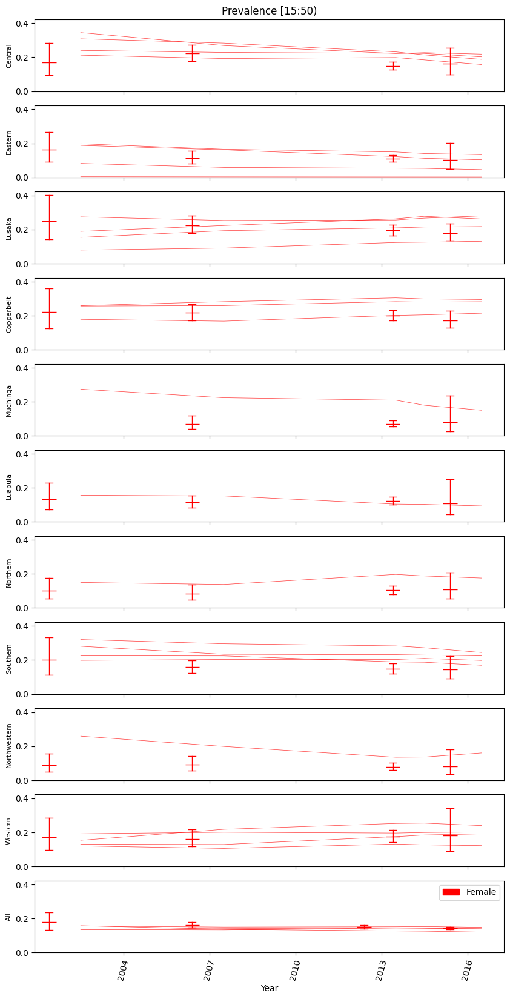

# Run Calibration

## What is calibration?

Calibration is an iterative process of altering a selection of model hyperparameters in a methodical manner to find sets
of parameterizations that well-represent provided observational reference data. It is as much an art as a science, so 
this tutorial will focus on the nuts-and-bolts of calibration. Calibrating **well** is beyond this guide.

## Start a calibration

The following command will start a calibration of a frame named **baseline** created in a prior tutorial:

```bash
python -m emodpy_workflow.scripts.calibrate -N BaselineCalibration -F baseline -i 2 -n 8 -o calibration/ -p ContainerPlatform optim_tool -v 0.1
```

While we are waiting for it to complete, we will review some details related to what is actually happening.

## Configure a calibration

The `calibrate` command is the command for model calibration in emodpy-workflow. There are a few basic controls for 
the `calibrate` command that can be used to adjust how long and how deeply it looks for good model parameterizations. 
We will briefly review the ones we just used. Further controls are documented by **calibrate** itself:

```bash
python -m emodpy_workflow.scripts.calibrate --help
```

`calibrate` command controls:

-i NUMBER : how many sequential iterations the process will perform, for example,

```bash
-i 2
```

-n NUMBER : how many different parameterizations (simulations) to try per iteration, for example,

```bash
-n 8
```

-N NAME : the name of the calibration to perform, various uses, for example,

```bash
-N BaselineCalibration
```

Very generally, more iterations and more parameterizations per iteration yield better results but increase computation
time/cost.

`optim_tool` algorithm command controls:

optim_tool is the algorithm we selected for scoring parameterizations.

-v FRACTION (0.0-1.0) : the fraction of hyperparameter space to explore in an iteration. Lower means the algorithm
takes small steps from its current best parameterization, higher means to take larger steps, for example,

```bash
optim_tool -v 0.1
```


### Ingest forms (reference data and analysis controls)

The goal of calibration is to find model configurations that can reasonably match reference data. This requires:

- reference data
- model output generation
- a scoring system for model output (good or bad, better or worse)

Running **calibrate** generates the model output needed. Reference data and scoring systems are defined in an 
**ingest form**, which is a multi-sheet Excel spreadsheet with some embedded helper macros. Please see the [ingest form 
reference documentation](../reference/ingest_form.md) for more information.

## Calibration output

The above calibration command will put information related to calibration status and simulation scoring into the
directory: `calibration/BaselineCalibration` (calibration name). The highest-numbered directory of iteration information (like iter1 in
our example) contains pdf plots of information relevant to the progress of calibration and can provide information
to aid in determining if the current set of hyperparameters being modified are sufficient.

## Resample a calibration process (selecting parameterizations)

Resampling a calibration is the process of selecting parameterizations from a calibration process. There is more than
one algorithm for doing so. The selected parameterizations **are** a calibration (good, bad, in progress, etc.).

emodpy-workflow has a built-in command named **resample** for this process. The following command will select the four
simulations from the above calibration command output that **best** match the reference data in the ingest form, writing
them to a CSV file:

```bash
python -m emodpy_workflow.scripts.resample -d calibration/BaselineCalibration -m best -n 4 -o samples.csv
```

!!! Important
    A resampled csv file **is** a calibration (good, bad, in progress, etc.)

## Plot the calibration

Now what we have a calibration (a resampled CSV file), we can plot it with reference data to visually assess its 
performance. The built-in emodpy-workflow command for this is **plot_sims_with_reference** . Continuing the example, 
the following will plot female HIV prevalance in the four resampled simulations with overlain reference
data:

```bash
python -m emodpy_workflow.scripts.plot_sims_with_reference -F baseline -s samples.csv -c Prevalence -g Female -p ContainerPlatform
```

The resultant plots are written by default to directory **plot_sims_with_reference_output**. Take a look, for example,



## What is next? Using a calibration!

Good calibrations are the starting point for modeling real-world scientific questions. In emodpy-workflow, calibrations
are used as input to the `run` command, which can combine calibrated parameterizations with "what if" scenario/sweep
parameterizations. This is often simply called "running scenarios" or "performing a sweep".

Additional resources:

* [Sweep parameters tutorial](sweep_parameter.md)
* [How to sweep](../how_to/how_to_sweep.md)
