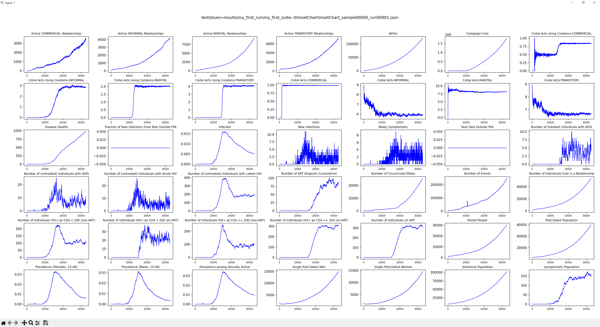
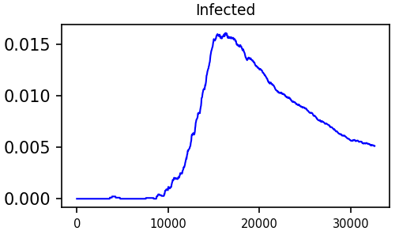

# Run EMOD

## Objective

The goal of this tutorial is for you to learn how to run a single simulation of EMOD-HIV
using emodpy-workflow.  There are many ways to run EMOD:

- From the command line
- Using emodpy-hiv
- Using emodpy-workflow
- On an HPC
- On your laptop
- As part of a parameter calibration
- As a parameter sweep

However, you will frequently want to run a single simulation when you creating different
behaviors in your simulation or while debugging.

## Prerequisites

To run EMOD per the instructions of this tutorial, you need to have done the followinng:

- [Setup and installed emodpy-workflow](setup.md)
- [Created a project and a frame](create_project.md)

## Control how and where EMOD runs

Before we can start using the "run" command, we first need to know where we can control
the what and where EMOD runs.  The [manifest.py](../reference/projects.md#manifestpy) file is used by
emopdy-workflow to know what EMOD executable binary to use, to specify a container for
the executable binary to run in, to specify any simulation post processing scripts, etc.
The [idmtools.ini](../reference/projects.md#idmtoolsini) file is used to specify how EMOD is run on
different platforms, where a "platform" is a computing device like an HPC or laptop.

### View manifest.py

1. In the root of your project directory, open the `manifest.py` file.
2. On about line 39, you should see a variable called `executable_path`.  This tells
emodpy-workflow where to get the EMOD executable binary.
3. Just below that you should also see a variable called `asset_collection_of_container`.
This is variable is used by emodpy-workflow to know what container to run EMOD in.
(Containers reduce your need to install everything needed to run EMOD.)
4. For more information see [manifest.py](../reference/projects.md#manifestpy).

### View idmtools.ini

1. In the root of your project directory, open the `idmtools.ini` file.
2. Towards the top of the file, you should see something similar to the following:

    ```doscon
    [ContainerPlatform]
    type          = Container
    job_directory = emodpy-jobs
    ```

3. This tells emodpy-workflow that there is a platform called `ContainerPlatform` that is
of type `Container` and that simulation jobs should go in to the `emodpy-jobs` directory.
4. For more information see [idmtools.ini](../reference/projects.md#idmtoolsini).

## Create a `results` directory

Since we will be running EMOD multiple times, it is handy to put the results into their
own directory.

1. Execute the following command in the root of your project (the directory that contains
the `manifest.py` file):

    ```
    mkdir results
    ```

    This should create a directory called `results` in your project directory.

## Using the `run` command

To run EMOD, we will use the emodpy-workflow `run` command.

1. Execute the following command in the root of your project:

    ```
    python -m emodpy_workflow.scripts.run -h
    ```

    This should produce output similar to the following:

    ```doscon
    usage: run.py [-h] [-s SAMPLES_FILE] -N SUITE_NAME -f FRAMES [-d DOWNLOAD_FILENAMES] -o OUTPUT_DIR -p PLATFORM
                [-w SWEEP]

    optional arguments:
    -h, --help            show this help message and exit
    -s SAMPLES_FILE, --samples SAMPLES_FILE
                            csv file with base samples to use for simulation generation. Runs one sim per frame with
                            configs as-is if not provided.
    -N SUITE_NAME, --suite-name SUITE_NAME
                            Name of suite for experiments to be run within (Required).
    -f FRAMES, --frames FRAMES
                            Comma-separated list of model frames to run (Required).
    -d DOWNLOAD_FILENAMES, --files DOWNLOAD_FILENAMES
                            Filenames to download from scenario simulations. Paths relative to simulation directories.
                            Comma-separated list if more than one (Default: do not download files)
    -o OUTPUT_DIR, --output-dir OUTPUT_DIR
                            Directory to write receipt to (always) and scenario output files (if downloading).
    -p PLATFORM, --platform PLATFORM
                            Platform to run simulations on (Required).
    -w SWEEP, --sweep SWEEP
                            Python module to load with a sweep definition to generate extra experiments with (Default: no
                            sweeping).
    ```

2. For our purposes, we are going to focus on the following arguments:
    - _suite name_ - This is the name you give to a collection of experiments, 'my_first_suite'.
    - _frame_ - This is the name of the frame who's configuration is what you want to use.
    In our case, it will be 'baseline'
    - _output directory_ - The path of the directory to put the data for your run, say 'results/my_first_run'.
    - _platform_ - This is the name of a platform defined in your 'idmtools.ini' file.
    We will be using 'ContainerPlatform'.

3. Execute the following command:

    ```doscon
    python -m emodpy_workflow.scripts.run -N my_first_suite -f baseline -o results/my_first_run -p ContainerPlatform
    ```

    You should see output similar to the following:

    === "Windows"
        ```doscon
        INI File Found: C:\work\emodpy-training\idmtools.ini

        Initializing ContainerPlatform with:
        {
        "job_directory": "emodpy-jobs"
        }
        Creating Suites: 100%|████████████████████████████████████████████████████████████████████████| 1/1 [00:00<?, ?suite/s]
        Creating Experiments:   0%|                                                              | 0/1 [00:00<?, ?experiment/s]>>>>>>>>>>>>>>>>>>>>>>>>>>>>>>>>>>>>>>>>>>>>>>>>>>>>>>>>>>>>>>>>>>>>>>>>>>>>>>>>
        Total parameter access counts:
        {}
        <<<<<<<<<<<<<<<<<<<<<<<<<<<<<<<<<<<<<<<<<<<<<<<<<<<<<<<<<<<<<<<<<<<<<<<<<<<<<<<<
        Creating Experiments: 100%|██████████████████████████████████████████████████████| 1/1 [00:06<00:00,  6.50s/experiment]
        Initializing objects for creation: 0simulation [00:00, ?simulation/s]>>>>>>>>>>>>>>>>>>>>>>>>>>>>>>>>>>>>>>>>>>>>>>>>>>>>>>>>>>>>>>>>>>>>>>>>>>>>>>>>
        Total parameter access counts:
        {}
        <<<<<<<<<<<<<<<<<<<<<<<<<<<<<<<<<<<<<<<<<<<<<<<<<<<<<<<<<<<<<<<<<<<<<<<<<<<<<<<<
        Commissioning Simulations: 100%|█████████████████████████████████████████████████| 1/1 [00:00<00:00, 17.86simulation/s]
        job_directory: C:\work\emodpy-training\emodpy-jobs
        suite: 2cf29edc-6b4d-459b-9542-3eae5c59a151
        experiment: 8ae683e4-8af6-4cd9-b8a3-5c63a5a10a17

        Experiment Directory:
        C:\work\emodpy-training\emodpy-jobs\my_first_suite_2cf29edc-6b4d-459b-9542-3eae5c59a151\my_first_suite_8ae683e4-8af6-4cd9-b8a3-5c63a5a10a17

        Container ID: c3a6a8de63be

        You may try the following command to check simulations running status:
        idmtools container status 8ae683e4-8af6-4cd9-b8a3-5c63a5a10a17
        Wrote run.py receipt to: results/my_first_run\experiment_index.csv
        Done with model experiment creation.
        ```
    === "Linux"
        ```doscon
        INI File Found: /home/internal.idm.ctr/dbridenbecker/emodpy/my_tutorial/my_project/idmtools.ini

        Initializing ContainerPlatform with:
        {
        "job_directory": "emodpy-jobs"
        }
        Creating Suites: 100%|███████████████████████████████████████████████████████████████████████████████████| 1/1 [00:00<00:00, 1602.10suite/s]
        Creating Experiments:   0%|                                                                                   | 0/1 [00:00<?, ?experiment/s]>>>>>>>>>>>>>>>>>>>>>>>>>>>>>>>>>>>>>>>>>>>>>>>>>>>>>>>>>>>>>>>>>>>>>>>>>>>>>>>>
        Total parameter access counts:
        {}
        <<<<<<<<<<<<<<<<<<<<<<<<<<<<<<<<<<<<<<<<<<<<<<<<<<<<<<<<<<<<<<<<<<<<<<<<<<<<<<<<
        Creating Experiments: 100%|███████████████████████████████████████████████████████████████████████████| 1/1 [00:05<00:00,  5.15s/experiment]
        Initializing objects for creation: 0simulation [00:00, ?simulation/s]>>>>>>>>>>>>>>>>>>>>>>>>>>>>>>>>>>>>>>>>>>>>>>>>>>>>>>>>>>>>>>>>>>>>>>>>>>>>>>>>
        Total parameter access counts:
        {}
        <<<<<<<<<<<<<<<<<<<<<<<<<<<<<<<<<<<<<<<<<<<<<<<<<<<<<<<<<<<<<<<<<<<<<<<<<<<<<<<<
        Commissioning Simulations: 100%|██████████████████████████████████████████████████████████████████████| 1/1 [00:00<00:00, 67.47simulation/s]
        job_directory: /home/internal.idm.ctr/dbridenbecker/emodpy/my_tutorial/my_project/emodpy-jobs
        suite: 38dbabe0-e7f7-49ee-a8f3-983f3657b01d
        experiment: 07c1fa36-2f8b-41f0-a7fe-1afdf5e6233a

        Experiment Directory: 
        /home/internal.idm.ctr/dbridenbecker/emodpy/my_tutorial/my_project/emodpy-jobs/my_first_suite_38dbabe0-e7f7-49ee-a8f3-983f3657b01d/my_first_suite_07c1fa36-2f8b-41f0-a7fe-1afdf5e6233a

        Container ID: c4d227306f49

        You may try the following command to check simulations running status: 
        idmtools container status 07c1fa36-2f8b-41f0-a7fe-1afdf5e6233a
        Wrote run.py receipt to: results/my_first_run/experiment_index.csv
        Done with model experiment creation.
        ```

    !!! Note
        This means that the simulations have been submitted to start running.
        It does not mean they are done.

## Get status on your experiment

Notice how in the last four lines of the output that there is information about finding
the status of your output.  In this case, the following line

=== "Windows"
    ```doscon
    idmtools container status 8ae683e4-8af6-4cd9-b8a3-5c63a5a10a17
    ```
=== "Linux"
    ```doscon
    idmtools container status 07c1fa36-2f8b-41f0-a7fe-1afdf5e6233a
    ```

says get status on experiment with the given ID.

If you execute that line, you should see something similar to:

=== "Windows"
    ```doscon
    INI File Found: C:\work\emodpy-training\idmtools.ini

    Experiment Directory:
    c:/work/emodpy-training/emodpy-jobs/my_first_suite_2cf29edc-6b4d-459b-9542-3eae5c59a151/my_first_suite_8ae683e4-8af6-4cd
    9-b8a3-5c63a5a10a17

    Simulation Count: 1

    SUCCEEDED (1)
    FAILED (0)
    RUNNING (0)
    PENDING (0)
    ```
=== "Linux"
    ```doscon
    INI File Found: /home/internal.idm.ctr/dbridenbecker/emodpy/my_tutorial/my_project/idmtools.ini

    Experiment Directory: 
    /home/internal.idm.ctr/dbridenbecker/emodpy/my_tutorial/my_project/emodpy-jobs/my_first_suite_38dbabe0-e7f7-49ee-a8f3-983f3657b01d/my_first_
    suite_07c1fa36-2f8b-41f0-a7fe-1afdf5e6233a

    Simulation Count: 1

    SUCCEEDED (1)
    FAILED (0)
    RUNNING (0)
    PENDING (0)
    ```

!!! Note
    This only works when using the Container Platform.  To see status
    when using other platforms, please see the
    [Command Line Interface documentation](https://docs.idmod.org/projects/idmtools/en/latest/cli/cli_index.html)
    for your platform.

## View the files produced when running an experiment

When using the Container and SLURM platforms, you can access the directories where the
experiments and simulations are running.  In our case, we are using the Container Platform
and our idmtools.ini file told emodpy-workflow to put the files into a local folder
called "emodpy-jobs".  If we navigate into this folder, we can see all of the files
associated with running the experiment and simulations.  Let's go investigate.

1. From the main project directory execute the following commands:

    === "Windows"
        ```doscon
        cd emodpy-jobs
        dir
        ```
    === "Linux"
        ```bash
        cd emodpy-jobs
        ls -l
        ```

    You should see something similar to:

    === "Windows"
        ```doscon
        Directory of C:\work\my_training\my_project\emodpy-jobs

        09/02/2025  01:30 PM    <DIR>          .
        09/02/2025  01:30 PM    <DIR>          ..
        09/02/2025  01:30 PM    <DIR>          my_first_suite_2f7f3943-0814-418a-9792-604fc7db2a31
        ```
    === "Linux"
        ```doscon
        total 4
        drwxrwxr-x 3 dbridenbecker dbridenbecker 4096 Sep  5 12:32 my_first_suite_38dbabe0-e7f7-49ee-a8f3-983f3657b01d
        ```

    Notice the directory `my_first_suite_2f7f3943-0814-418a-9792-604fc7db2a31` starts
    with the name we gave the suite.

2. Look in the the **suite directory** by executing commands similar to the
following (your directory name is likely different):

    === "Windows"
        ```doscon
        cd my_first_suite_2f7f3943-0814-418a-9792-604fc7db2a31
        dir
        ```
    === "Linux"
        ```bash
        cd my_first_suite_38dbabe0-e7f7-49ee-a8f3-983f3657b01d
        ls -l
        ```

    You should see something similar to the following:

    === "Windows"
        ```doscon
        Directory of C:\work\my_training\my_project\emodpy-jobs\my_first_suite_2f7f3943-0814-418a-9792-604fc7db2a31

        09/02/2025  01:30 PM    <DIR>          .
        09/02/2025  01:30 PM    <DIR>          ..
        09/02/2025  01:30 PM               484 metadata.json
        09/02/2025  01:30 PM    <DIR>          my_first_suite_857c15be-a4b9-4d46-86f5-d0c0f9a2fbe5
        ```
    === "Linux"
        ```
        total 8
        -rw-rw-r-- 1 dbridenbecker dbridenbecker  515 Sep  5 12:32 metadata.json
        drwxrwxr-x 4 dbridenbecker dbridenbecker 4096 Sep  5 12:32 my_first_suite_07c1fa36-2f8b-41f0-a7fe-1afdf5e6233a
        ```

    Yes, it looks very similar, but this is the experiment directory.

3. Look in the **experiment directory** by executing commands similar to the
following (your directory name is likely different):
    === "Windows"
        ```doscon
        cd my_first_suite_857c15be-a4b9-4d46-86f5-d0c0f9a2fbe5
        dir
        ```
    === "Linux"
        ```bash
        cd my_first_suite_07c1fa36-2f8b-41f0-a7fe-1afdf5e6233a
        ls -l
        ```

    You should see something similar to the following:

    === "Windows"
        ```doscon
        Directory of C:\work\my_training\my_project\emodpy-jobs\my_first_suite_2f7f3943-0814-418a-9792-604fc7db2a31\my_first_suite_857c15be-a4b9-4d46-86f5-d0c0f9a2fbe5

        09/02/2025  01:30 PM    <DIR>          .
        09/02/2025  01:30 PM    <DIR>          ..
        09/02/2025  01:30 PM    <DIR>          84efd93c-b13a-4bd4-ae54-f4ac5ab7aa9d
        09/02/2025  01:30 PM    <DIR>          Assets
        09/02/2025  01:30 PM               229 batch.sh
        09/02/2025  01:30 PM             1,006 metadata.json
        09/02/2025  01:30 PM               179 run_simulation.sh
        09/02/2025  01:30 PM                 0 stderr.txt
        09/02/2025  01:30 PM               181 stdout.txt
        ```
    === "Linux"
        ```doscon
        total 24
        drwxrwxr-x 3 dbridenbecker dbridenbecker 4096 Sep  5 12:32 45eefc10-bf1d-48bf-a7f0-d90d1c94bd8f
        drwxrwxr-x 2 dbridenbecker dbridenbecker 4096 Sep  5 12:32 Assets
        -rwxrwxrwx 1 dbridenbecker dbridenbecker  229 Sep  5 12:32 batch.sh
        -rw-rw-r-- 1 dbridenbecker dbridenbecker 1067 Sep  5 12:32 metadata.json
        -rwxrwxrwx 1 dbridenbecker dbridenbecker  179 Sep  5 12:32 run_simulation.sh
        -rw-r--r-- 1 root          root             0 Sep  5 12:32 stderr.txt
        -rw-r--r-- 1 root          root           181 Sep  5 12:32 stdout.txt
        ```

    The **experiment** directory will have one folder for each simulation of the
    experiment.  In this case, there is only one simulation with ID:

    === "Windows"
        `84efd93c-b13a-4bd4-ae54-f4ac5ab7aa9d`
    === "Linux"
        `45eefc10-bf1d-48bf-a7f0-d90d1c94bd8f`
    
    For the most part, you do not need to know about the other files in the directory.
    However, the `metadata.json` file does contain some details about the experiment
    and its simulations.

4. Look in the **simulation directory** `84efd93c-b13a-4bd4-ae54-f4ac5ab7aa9d`

    === "Windows"
        ```doscon
        cd 84efd93c-b13a-4bd4-ae54-f4ac5ab7aa9d
        dir
        ```
    === "Linux"
        ```bash
        cd 45eefc10-bf1d-48bf-a7f0-d90d1c94bd8f
        ls -l
        ```

    You should see something similar to the following:

    === "Windows"
        ```doscon
        Directory of C:\work\my_training\my_project\emodpy-jobs\my_first_suite_2f7f3943-0814-418a-9792-604fc7db2a31\my_first_suite_857c15be-a4b9-4d46-86f5-d0c0f9a2fbe5\84efd93c-b13a-4bd4-ae54-f4ac5ab7aa9d

        09/02/2025  01:30 PM    <DIR>          .
        09/02/2025  01:30 PM    <DIR>          ..
        09/02/2025  01:30 PM    <SYMLINKD>     Assets [..\Assets]
        09/02/2025  01:30 PM           206,144 campaign.json
        09/02/2025  01:30 PM             7,226 config.json
        09/02/2025  01:32 PM                 2 job_status.txt
        09/02/2025  01:30 PM             9,310 metadata.json
        09/02/2025  01:32 PM    <DIR>          output
        09/02/2025  01:32 PM            30,139 status.txt
        09/02/2025  01:30 PM                 0 stderr.txt
        09/02/2025  01:32 PM           120,255 stdout.txt
        09/02/2025  01:30 PM           330,404 tmpncr6smi4.json
        09/02/2025  01:30 PM               762 _run.sh
        ```
    === "Linux"
        ```doscon
        total 704
        lrwxrwxrwx 1 dbridenbecker dbridenbecker      9 Sep  5 12:32 Assets -> ../Assets
        -rw-rw-r-- 1 dbridenbecker dbridenbecker 206144 Sep  5 12:32 campaign.json
        -rw-rw-r-- 1 dbridenbecker dbridenbecker   7257 Sep  5 12:32 config.json
        -rw-r--r-- 1 root          root               2 Sep  5 12:34 job_status.txt
        -rw-rw-r-- 1 dbridenbecker dbridenbecker   9393 Sep  5 12:32 metadata.json
        drwxr-xr-x 2 root          root            4096 Sep  5 12:34 output
        -rwxrwxrwx 1 dbridenbecker dbridenbecker    762 Sep  5 12:32 _run.sh
        -rw-r--r-- 1 root          root           30139 Sep  5 12:34 status.txt
        -rw-r--r-- 1 root          root               0 Sep  5 12:32 stderr.txt
        -rw-r--r-- 1 root          root          120255 Sep  5 12:34 stdout.txt
        -rw-rw-r-- 1 dbridenbecker dbridenbecker 320723 Sep  5 12:32 tmpu8tbs9qp.json
        ```

    The **simulation directory** is the directory where a single realization/simulation
    of EMOD is being run.  If you have simulations that are failing or not running to
    completion, you should look at the `stderr.txt` file and the `stdout.txt` file.
    These files can contain error messages directly from the EMOD executable.  Finally,
    the `output` directory contains the report data that was generated for this
    realization/simulation.  (We will be using the `download` command to organize our
    report files, but if that becomes limiting, you can access them directly.)

    !!! Note
        If something is failing or not working like you expect, an EMOD developer
        will need the contents of this directory in order to duplicate and debug
        the issue.

5. View the end of the `stdout.txt` file.

    Use a text editor to view `stdout.txt` file and scroll to the bottom.  You should
    see something similar to the following:

    ```doscon
    00:01:56 [0] [I] [Simulation] Update(): Time: 32606.4 Year: 2049.8 Rank: 0 StatPop: 102414 Infected: 529
    00:01:57 [0] [I] [Simulation] Update(): Time: 32636.8 Year: 2049.9 Rank: 0 StatPop: 102636 Infected: 528
    00:01:57 [0] [I] [Simulation] Finalizing 'InsetChart.json' reporter.
    00:01:57 [0] [I] [Simulation] Finalized  'InsetChart.json' reporter.
    00:01:57 [0] [I] [Simulation] Finalizing 'ReportHIVByAgeAndGender.csv' reporter.
    00:01:57 [0] [I] [Simulation] Finalized  'ReportHIVByAgeAndGender.csv' reporter.
    00:01:57 [0] [I] [Eradication] Controller executed successfully.
    ```

    The `stdout.txt` file contains information that EMOD can log to standard out.
    For example, the line that has `[Simulation] Update(): Time:` in it is printed
    each time step of the simulation.  Seeing these being written out can be helpful
    to know that the simulation is still running.  The line that contains
    `Controller executed successfully` lets us know that the simulation has finished.
    This file can contain warnings or error messages.  This can be a great place to
    look when starting to debug why your simulations are not running.

6. Go back to the project directory - `my_project`

    === "Windows"
        ```
        cd ..
        cd ..
        cd ..
        cd ..
        cd
        ```
    === "Linux"
        ```
        cd ..
        cd ..
        cd ..
        cd ..
        pwd
        ```

    You should see something similar to:

    === "Windows"
        ```doscon
        C:\work\my_training\my_project>
        ```
    === "Linux"
        ```doscon
        /home/internal.idm.ctr/dbridenbecker/emodpy/my_tutorial/my_project
        ```

    You should be back to your [project directory](../reference/projects.md).

## View the `results/my_first_run` folder and the "receipt file"

In our `run` command, you specified the output as `-o results/my_first_run`.

1. Look at the contents of the `results/my_first_run` folder

    === "Windows"
        ```doscon
        dir results\my_first_run
        ```
    === "Linux"
        ```bash
        ls -l results/my_first_run
        ```

    You should see something similar to the following:

    === "Windows"
        ```doscon
        Directory of C:\work\my_training\my_project\results\my_first_run

        09/02/2025  02:52 PM    <DIR>          .
        09/02/2025  02:52 PM    <DIR>          ..
        09/02/2025  01:30 PM               275 experiment_index.csv
        ```
    === "Linux"
        ```doscon
        total 4
        -rw-rw-r-- 1 dbridenbecker dbridenbecker 309 Sep  5 12:32 experiment_index.csv
        ```

2. Look at the contents of the `results/my_first_run/experiment_index.csv`

    === "Windows"
        ```doscon
        type results\my_first_run\experiment_index.csv
        ```
    === "Linux"
        ```doscon
        cat results/my_first_run/experiment_index.csv
        ```

    You should see something similar to the following:

    === "Windows"
        ```doscon
        index,frame,experiment_id,experiment_name,experiment_directory
        0,baseline,857c15be-a4b9-4d46-86f5-d0c0f9a2fbe5,my_first_suite,C:\work\my_training\my_project\emodpy-jobs\my_first_suite_2f7f3943-0814-418a-9792-604fc7db2a31\my_first_suite_857c15be-a4b9-4d46-86f5-d0c0f9a2fbe5
        ```
    === "Linux"
        ```doscon
        index,frame,experiment_id,experiment_name,experiment_directory
        0,baseline,07c1fa36-2f8b-41f0-a7fe-1afdf5e6233a,my_first_suite,/home/internal.idm.ctr/dbridenbecker/emodpy/my_tutorial/my_project/emodpy-jobs/my_first_suite_38dbabe0-e7f7-49ee-a8f3-983f3657b01d/my_first_suite_07c1fa36-2f8b-41f0-a7fe-1afdf5e6233a
        ```

    This file can provide you information about the experiment and where the files
    are located.  We will use it in our next step to download the report data.

## Download the results/output/reports

Now that we have seen all of the files created when running an experiment,
let's get back to our project directory and get our report data.

2. Execute the `download` command to see what the options are

    ```
    python -m emodpy_workflow.scripts.download -h
    ```

    You should see something similar to the following:

    ```doscon
    (env) C:\work\my_training\my_project>python -m emodpy_workflow.scripts.download -h
    usage: download.py [-h] [-d FILES] [-r RECEIPT_FILE] [-s SAMPLES_FILE] [--suite-id SUITE_ID] [--exp-id EXPERIMENT_ID]
                    [-o OUTPUT_DIR] -p PLATFORM

    optional arguments:
    -h, --help            show this help message and exit
    -d FILES, --files FILES
                            Comma-separated list of simulation directory relative file paths to download (Default:
                            output\ReportHIVByAgeAndGender.csv)
    -r RECEIPT_FILE, --receipt RECEIPT_FILE
                            Commissioning receipt file path. Either set -r OR (--suite-id and -o) OR (--exp-id and -o) OR
                            (-s and -o).
    -s SAMPLES_FILE, --samples SAMPLES_FILE
                            Resampled parameter sets csv file of simulations to plot. Either set -r OR (--suite-id and -o)
                            OR (--exp-id and -o) OR (-s and -o).
    --suite-id SUITE_ID   Id of suite to download simulations from. Either set -r OR (--suite-id and -o) OR (--exp-id
                            and -o) OR (-s and -o).
    --exp-id EXPERIMENT_ID
                            Id of experiment to download simulations from. Either set -r OR (--suite-id and -o) OR (--exp-
                            id and -o) OR (-s and -o).
    -o OUTPUT_DIR, --output-dir OUTPUT_DIR
                            Directory to write output into. Either set -r OR (--suite-id and -o) OR (--exp-id and -o) OR
                            (-s and -o).
    -p PLATFORM, --platform PLATFORM
                            Platform to download from (Required).
    ```

3. Execute the `download` command to download the InsetChart.json files

    === "Windows"
        ```doscon
        python -m emodpy_workflow.scripts.download -d "output/InsetChart.json" -r results\my_first_run\experiment_index.csv -p ContainerPlatform
        ```
    === "Linux"
        ```bash
        python -m emodpy_workflow.scripts.download -d "output/InsetChart.json" -r results/my_first_run/experiment_index.csv -p ContainerPlatform
        ```

    In this command, we specified the following:

    - `-d "output/InsetChart.json` - EMOD puts the report files into a subfolder
    called "outputs".  In this case, we want the InsetChart.json report since
    it contains a lot of high level statistics.
    - `-r results/my_first_run/experiment_index.csv` - Since we have a "receipt"
    file, we use it here to tell the `download` command where the data is.
    - `-p ContainerPlatform` - This tells the `download` command to use the
    Container protocol when getting data.

    You should see something similar to the following:

    ```doscon
    INI File Found: /home/internal.idm.ctr/dbridenbecker/emodpy/my_tutorial/my_project/idmtools.ini

    Initializing ContainerPlatform with:
    {
    "job_directory": "emodpy-jobs"
    }
    Waiting on Experiment my_first_suite to Finish running: 100%|█████████████████████████████████████| 1/1 [00:00<00:00, 2343.19simulation/s]
    100%|███████████████████████████████████████████████████████████████████████████████████████████████████████| 1/1 [00:00<00:00, 25.25it/s]
    Running Analyzer Reduces: 100%|████████████████████████████████████████████████████████████████████████████| 1/1 [00:00<00:00, 465.67it/s]
    Done downloading files to: /home/internal.idm.ctr/dbridenbecker/emodpy/my_tutorial/my_project/results/my_first_run
    ```

    As you can tell, there are many ways to specify the download of the data.
    The [how-tos](../how_to/how_to_download_data.md) can show you different
    ways to do it.

4. See that a new folder was added to the `results/my_first_run:

    === "Windows"
        ```doscon
        dir results\my_first_run
        ```
    === "Linux"
        ```
        ls -l results/my_first_run
        ```

    Now when we look in this folder we should see something similar to the following:

    === "Windows"
        ```doscon
        Directory of C:\work\my_training\my_project\results\my_first_run

        09/02/2025  02:52 PM    <DIR>          .
        09/02/2025  02:52 PM    <DIR>          ..
        09/02/2025  01:30 PM               275 experiment_index.csv
        09/02/2025  02:52 PM    <DIR>          my_first_suite--0
        ```
    === "Linux"
        ```doscon
        total 8
        -rw-rw-r-- 1 dbridenbecker dbridenbecker  309 Sep  5 12:32 experiment_index.csv
        drwxrwxr-x 3 dbridenbecker dbridenbecker 4096 Sep  5 15:00 my_first_suite--0
        ```

    The `my_first_suite--0` directory was created.

5. See that a folder was created with the name of the report:

    === "Windows"
        ```doscon
        dir results\my_first_run\my_first_suite--0
        ```
    === "Linux"
        ```
        ls -l results/my_first_run/my_first_suite--0
        ```

    You should see something similar to the following:

    === "Windows"
        ```doscon
        Directory of C:\work\my_training\my_project\results\my_first_run\my_first_suite--0

        09/02/2025  02:52 PM    <DIR>          .
        09/02/2025  02:52 PM    <DIR>          ..
        09/02/2025  02:52 PM    <DIR>          InsetChart
        ```
    === "Linux"
        ```doscon
        total 4
        drwxrwxr-x 2 dbridenbecker dbridenbecker 4096 Sep  5 15:00 InsetChart
        ```

    Notice that `InsetChart` is the base name of the report file we requested
    to download.

6. See where the data has been put by executing the following command:

    === "Windows"
        ```doscon
        dir results\my_first_run\my_first_suite--0\InsetChart
        ```
    === "Linux"
        ```bash
        ls -l results/my_first_run/my_first_suite--0/InsetChart
        ```

    You should see something similar to the following:

    === "Windows"
        ```doscon
        Directory of C:\work\my_training\my_project\results\my_first_run\my_first_suite--0\InsetChart

        09/02/2025  02:52 PM    <DIR>          .
        09/02/2025  02:52 PM    <DIR>          ..
        09/02/2025  02:52 PM           300,997 InsetChart_sample00000_run00001.json
        ```
    === "Linux"
        ```doscon
        total 296
        -rw-rw-r-- 1 dbridenbecker dbridenbecker 300997 Sep  5 15:00 InsetChart_sample00000_run00001.json
        ```

    The directory should contain one file for each simulation of the experiment.
    In this case, there is only one.

## Plot the results

Now that we have our data downloaded, let's plot the data to see what happened
in the simulation.

1. Execute the following command to see what options are available when plotting InsetChart.

    ```
    python -m emodpy_hiv.plotting.plot_inset_chart -h
    ```

    You should see something similar to the following:

    ```doscon
    (env) C:\work\my_training\my_project>python -m emodpy_hiv.plotting.plot_inset_chart -h
    usage: plot_inset_chart.py [-h] [-d [DIR]] [-t [TITLE]] [-o OUTPUT]
                            [reference] [comparison1] [comparison2] [comparison3]

    positional arguments:
    reference             Reference InsetChart filename
    comparison1           Comparison1 InsetChart filename
    comparison2           Comparison2 InsetChart filename
    comparison3           Comparison3 InsetChart filename

    optional arguments:
    -h, --help            show this help message and exit
    -d [DIR], --dir [DIR]
                            Directory, or parent directory that contains subdirectories, of InsetChart.json files
    -t [TITLE], --title [TITLE]
                            Title of Plot
    -o OUTPUT, --output OUTPUT
                            If provided, a directory will be created and images saved to the folder. If not provided, it
                            opens windows.
    ```

    !!! Note
        If you are executing these commands via SSH or on Codespaces, you
        will need to use the `-o` or `--output` option to create an image
        file that you can view.

2. Execute the following command to plot the data in InsetChart.json:

    === "Windows"
        ```doscon
        python -m emodpy_hiv.plotting.plot_inset_chart -d results\my_first_run\my_first_suite--0\InsetChart
        ```
    === "Linux"
        ```doscon
        python -m emodpy_hiv.plotting.plot_inset_chart -d results/my_first_run/my_first_suite--0/InsetChart
        ```

    This should produce an image or window that looks like the following:

    

    If we look at the plot in column three, row three, you see something like
    the following:

    

    where prevalence goes up to about 1.5% in the middle of the simulation and then
    declines to about 0.5%.

## Next up: Modifying the simulation

Now that you have run EMOD once, investigate the other tutorials where you can
modify the simulation and run the model.

- [Modify Reports](modify_reports.md)
- [Modify Configuration](modify_configuration.md)
- [Modify Campaign](modify_campaign.md)


